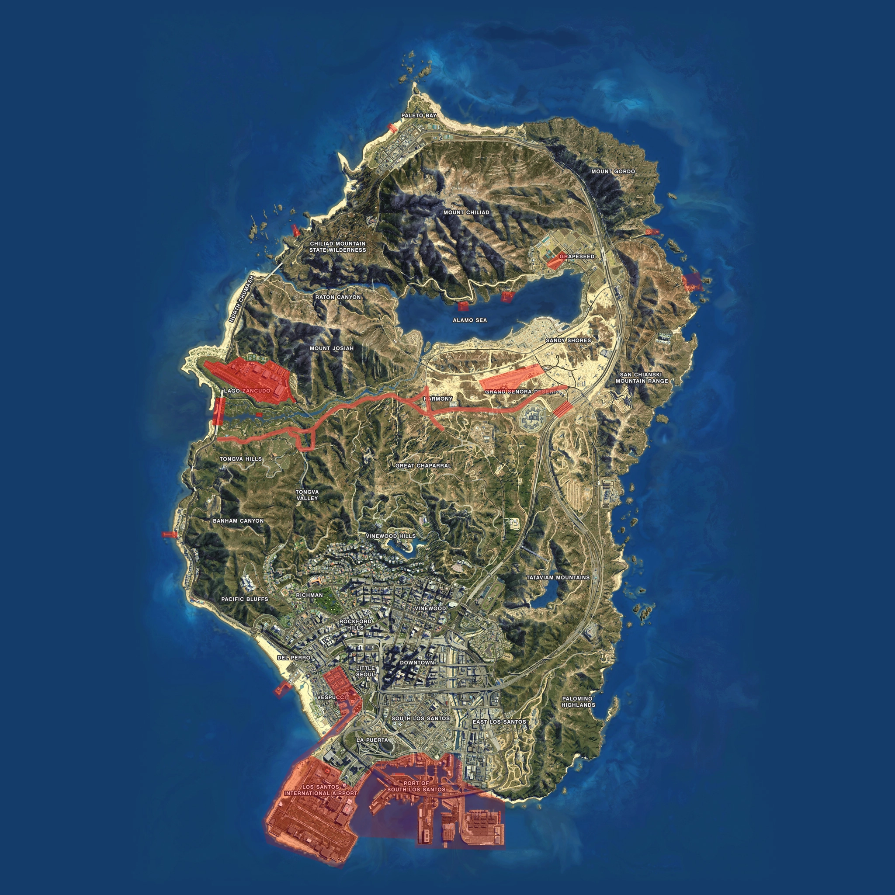

# Douanegebieden Gemeente Nieuweveen

## Juridische Grondslag en Definitie

De gemeente Nieuweveen heeft, conform de geldende wetgeving inzake douane en grensbewaking, specifieke douanegebieden aangewezen waar verhoogde controlebevoegdheden van toepassing zijn. Deze gebieden zijn vastgesteld ter waarborging van de openbare orde, veiligheid en ter voorkoming van grensoverschrijdende criminaliteit.

## Controlebevoegdheden

### Preventieve Fouillering

Binnen de aangewezen douanegebieden zijn bevoegde ambtenaren gerechtigd tot het uitvoeren van preventieve fouillering van personen en goederen. Deze bevoegdheid omvat:

- **Persoonscontrole**: Fouillering van personen zonder concrete verdenking
- **Voertuigcontrole**: Inspectie van motorvoertuigen, aanhangwagens en lading
- **Bagagecontrole**: Onderzoek van bagage, tassen en overige persoonlijke eigendommen
- **Documentcontrole**: Verificatie van identiteitsdocumenten en reisdocumentatie

### Uitbreidingsbevoegdheid

De korpsleiding van de Politie Nieuweveen is, in overleg met de gemeenteraad, bevoegd tot het aanwijzen van aanvullende douanegebieden. Voor deze uitgebreide zones gelden identieke controlebevoegdheden als voor de oorspronkelijk aangewezen douanegebieden.

---

## Geografische Afbakening

De onderstaande kaartweergave toont de exacte begrenzing van de douanegebieden binnen het gemeentelijk grondgebied van Nieuweveen. Deze zones zijn gemarkeerd conform de officiële gemeentelijke verordening.

### Kaartweergave Douanegebieden

**Toelichting bij de kaart:**
De gemarkeerde gebieden op bovenstaande kaart duiden de zones aan waar preventieve controles uitgevoerd mogen worden door bevoegde ambtenaren. Burgers dienen zich bewust te zijn van deze verhoogde controlebevoegdheden bij het betreden van deze gebieden.
